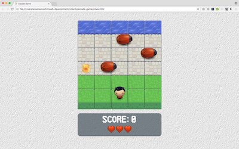
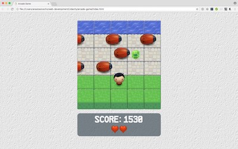

# Arcade Game

I created this game for the purposes of the [Udacity's Front-End Web Developer Nanodegree Program](https://www.udacity.com/course/front-end-web-developer-nanodegree--nd001) to showcase my OOP JavaScript skills.

## How to Load the game

- Clone the **[repo](https://github.com/anastasioscho/udacity-arcade-game)** and open index.html.

## How The Game Works

- You can move your player up, down, left and right using the arrow keys.
- You must avoid colliding with the enemies. The enemies move in varying speeds on the paved blocks.
- If you collide with an enemy, you lose a life and teleport back to the start. You only have three lives. If you lose them, the game is over.
- If you reach the water, you teleport back to the start.
- Various gems will appear on random locations on the paved blocks, which you can collect.
- Your goal is to reach the higher score you can.

## Score System

- You get 10 points each time you move forward.
- You loose 10 points each time you move back.
- You get 50 points each time you reach the water.
- You get 10 points for each blue gem you collect.
- You get 20 points for each green gem you collect.
- You get 30 points for each orange gem you collect.

Don't worry, you can't get a negative score!

## Difficulty level

Every three times you reach the water, a new enemy comes into play. The maximum number of enemies can't be more than 6.

## Screenshots

  

## Resources

### Fonts

- <https://www.fontsquirrel.com/>
- <http://www.fontspace.com/>
- <http://www.1001fonts.com/>

### Images

- <https://background-tiles.com/>